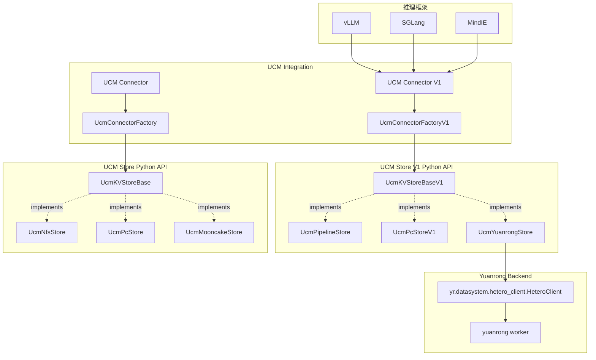
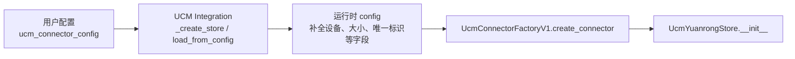
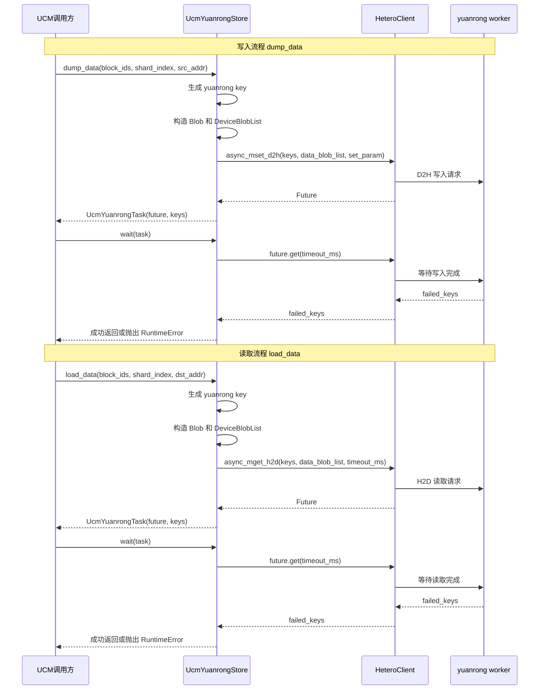

# Yuanrong Store 接入 UcmKVStoreBaseV1 需求方案设计

## 1. 背景

当前 UCM 项目需要将 yuanrong 数据系统作为可选 KV cache store 接入。vLLM、SGLang、MindIE 主链路主要使用 `UcmKVStoreBaseV1` 和 `UcmConnectorFactoryV1`，其核心数据传输接口是 `load_data` / `dump_data`，入参为 block id、shard index 和设备内存地址。

Yuanrong 数据系统提供 `yr.datasystem.hetero_client.HeteroClient`，其中 `mset_d2h` / `mget_h2d` 及其异步版本可以在设备内存与 host 数据系统之间传输数据；`Blob` 和 `DeviceBlobList` 可以直接描述设备内存地址、大小和 device id。因此本设计按 `UcmKVStoreBaseV1` 的指针传输接口完成 yuanrong store 的 Python 层适配。

## 2. 目标

1. 新增一个纯 Python 的 yuanrong store connector，实现 `UcmKVStoreBaseV1` 的基本功能。
2. 将 yuanrong 注册为 `UcmConnectorFactoryV1` 可创建的 store 选项。
3. 支持当前主链路所需的基础能力：`lookup`、`lookup_on_prefix`、`load_data`、`dump_data`、`load`、`dump`、`wait`。
4. 通过 mock yuanrong client 的单元测试验证接口映射、key 生成、任务等待和错误处理。
5. 不依赖真实 yuanrong worker 运行单元测试。

## 3. 非目标

1. 不实现 C++ `StoreV1`，不接入 PipelineStore 的 native stack。
2. 不实现 `cc_store()` 对 native 指针的真实返回；纯 Python store 返回 `0`。
3. 不实现高性能非阻塞 `check()` 轮询；基础版本仅做保守实现。
4. 不实现数据压缩、缓存分层、GC 或自动淘汰。
5. 不支持不规则 blob size 的自动推断；初版要求配置提供明确的传输大小。
6. 不在本阶段验证真实 yuanrong worker 的端到端部署。

## 4. 系统架构

适配后的 yuanrong store 位于 UCM Python store 层，对上实现 `UcmKVStoreBaseV1`，对下调用 yuanrong Python SDK 的 `HeteroClient`。推理框架仍通过 UCM 现有 connector 入口创建 store，不直接依赖 yuanrong SDK。

整体架构如下：


各层职责如下：

1. 推理框架层负责产生 UCM block id、shard index 和 KV cache 设备地址。
2. UCM Integration 层负责从框架配置中解析 store 名称和参数。当前主链路的 `UCM Connector V1` 通过 `UcmConnectorFactoryV1` 创建 `UcmKVStoreBaseV1` 实现；旧版 `UCM Connector` 通过 `UcmConnectorFactory` 创建 `UcmKVStoreBase` 实现。
3. `UcmKVStoreBaseV1` 定义当前主链路使用的 store 接口，现有选项包括 `UcmPipelineStore`、`UcmPcStoreV1`，本设计新增 `UcmYuanrongStore`。
4. `UcmYuanrongStore` 负责完成 UCM V1 接口到 yuanrong 接口的适配，包括 key 生成、地址结构转换、任务句柄包装和错误转换。
5. `HeteroClient` 负责和 yuanrong worker 通信，执行设备到 host、host 到设备的数据传输。
6. yuanrong worker 负责实际的数据存储、查询和传输调度。

该架构保持 UCM 主链路接口不变。新增逻辑集中在 `ucm/store/yuanrongstore/yuanrong_connector.py`，不会影响已有 store，也不要求推理框架感知 yuanrong 的内部 API。

### 4.1 配置流转与运行时补全

`UcmYuanrongStore` 初始化时接收的 `config` 不是用户配置文件的原始内容，而是 UCM Integration 层处理后的运行时配置。整体流转如下：



用户显式配置只负责描述 yuanrong 连接信息和必要的可调参数；KV cache 布局相关字段由上层 connector 在拿到框架运行时信息后补齐。这样可以避免要求用户手工填写与模型、并行度、block size、KV cache layout 强相关的字段。

主链路中的配置补全规则如下：

| 接入入口 | 场景 | 运行时补全字段 | 说明 |
| --- | --- | --- | --- |
| vLLM UCM Connector V1 | Worker | `device_id`、`tensor_size_list`、`shard_size`、`block_size`、`local_rank_size`、`gpu_kv_buffer_addrs`、`gpu_kv_buffer_sizes`、`unique_id`、`share_buffer_enable`、`posix_gc_enable` | `tensor_size_list` 来自 `KVCacheLayout`，是 `load_data` / `dump_data` 构造 yuanrong `Blob` size 的首选来源。 |
| vLLM UCM Connector V1 | Scheduler / lookup-only | `block_size`、`unique_id`、`share_buffer_enable`、`posix_gc_enable` | 该路径通常只做 `lookup`，不会提供 `tensor_size_list`、`device_id` 等传输字段。 |
| vLLM HMA Connector | Worker | `device_id`、`tensor_size_list`、`shard_size`、`block_size`、`local_rank_size`、`unique_id`、`posix_gc_enable` | `shard_size` / `block_size` 可能按 4KB 对齐，`Blob` size 仍以 `tensor_size_list` 为准。 |
| SGLang Connector | Worker | `device_id`、`tensor_size`、`shard_size`、`block_size` | 当前路径提供单一 `tensor_size`，不一定提供 `tensor_size_list`。 |
| MindIE Connector | Worker | `device_id`、`unique_id`、`tensor_size_list`、`shard_size`、`block_size` | `tensor_size_list` 由 KV cache tensor 信息计算得到。 |

对 `UcmYuanrongStore` 而言，配置字段分为三类：

1. 必需连接字段：`host`、`port`，用于构造 `HeteroClient`。
2. 可选行为字段：`key_prefix`、`timeout_ms`、`device_id` 等，未配置时使用保守默认值。
3. 传输大小字段：`tensor_size_list` 或 `tensor_size`，仅在执行 `load_data` / `dump_data` / `load` / `dump` 时需要。

其中 `tensor_size_list` 表示每个 block 对应的 blob size 列表，适用于一条 key 对应多个设备地址的场景；`tensor_size` 表示所有 blob 使用同一个大小，主要用于单 size 兼容路径。`shard_size` 表示一个 shard/block 的聚合大小，不应作为多 blob 场景下单个 `Blob` 的 size 来源。

## 5. 模块设计

新增模块：

```text
ucm/store/yuanrongstore/__init__.py
ucm/store/yuanrongstore/yuanrong_connector.py
```

新增类：

```python
class UcmYuanrongStore(UcmKVStoreBaseV1):
    ...
    
@dataclass
class UcmYuanrongTask(Task):
    future: object
    keys: list[str]
```

注册方式：

```python
# factory_v1.py
UcmConnectorFactoryV1.register_connector(
    "UcmYuanrongStore",
    "ucm.store.yuanrongstore.yuanrong_connector",
    "UcmYuanrongStore",
)
```

用户显式配置：

```yaml
# ucm_config.yaml
ucm_connectors:
  - ucm_connector_name: "UcmYuanrongStore"
    ucm_connector_config:
      host: "127.0.0.1"
      port: 18482
```

运行时补全后的 `UcmYuanrongStore.__init__` 可能接收到如下配置：

```python
{
    "host": "127.0.0.1",
    "port": 18482,
    "unique_id": "...",
    "device_id": 0,
    "tensor_size_list": [1048576, 1048576],
    "shard_size": 2097152,
    "block_size": 2097152,
    "local_rank_size": 1,
    "gpu_kv_buffer_addrs": [...],
    "gpu_kv_buffer_sizes": [...],
    "posix_gc_enable": False,
}
```

`UcmYuanrongStore` 只消费自身需要的字段。`gpu_kv_buffer_addrs`、`gpu_kv_buffer_sizes`、`local_rank_size`、`posix_gc_enable` 等字段会随主链路统一传入，但 yuanrong Python 层初版不需要使用这些字段。

## 6. Key 设计

UCM V1 的 `block_ids` 类型为 `list[bytes]`，yuanrong 的 key 类型为 `str`。

适配层统一生成稳定字符串 key：

```text
ucm:<block_id.hex()>:<shard_index>
```

示例：

```text
ucm:0a1b2c...:0
```

其中，shard_index：区分同一 block 在不同 layer/TP rank 下的数据

编码函数

```python
def _encode_key(self, block_id: bytes, shard_index: int) -> str:
    return f"{self.key_prefix}:{block_id.hex()}:{shard_index}"
```

## 7. 接口设计

### 7.1. 初始化

`UcmYuanrongStore.__init__(config)`：
1. 从配置读取 `host`、`port`、`key_prefix`、`timeout_ms`、`device_id` 等。
2. 记录传输大小配置，优先使用 `tensor_size_list`，其次兼容单 size 的 `tensor_size`。
3. 构造 `HeteroClient` 并调用 `init()`。
4. 若缺少必要连接配置，抛出 `ValueError`。
5. 若执行传输时缺少传输大小配置，抛出 `ValueError`。

### 7.2. `lookup(block_ids)`

使用第 6 节的 `_encode_key()` 方法，将 `block_ids` 编码为 yuanrong key 列表，调用：

```python
self.client.exist(keys)
```

返回 `list[bool]`。

### 7.3. `lookup_on_prefix(block_ids)`

1. 调用 lookup(block_ids) 获取命中列表
2. 从前向后扫描，返回最后一个连续命中的 index
3. 若第一个 block 未命中，返回 -1

### 7.4. `dump_data(block_ids, shard_index, src_addr, prerequisite_handle=0)`

1. 编码 keys：
  ```python
  keys = [self._encode_key(bid, sid) for bid, sid in zip(block_ids, shard_index)]
  ```
2. 将 src_addr: List[List[int]] | np.ndarray 二维地址矩阵转换为 DeviceBlobList：
  ```python
  DeviceBlobList(
   dev_idx=config["device_id"],
   blob_list=[Blob(ptr, size) for ptr, size in ...],
  )
  ```
3. 调用 `async_mset_d2h`接口：
  ```python
  future = self.client.async_mset_d2h(keys, data_blob_list, set_param)
  return UcmYuanrongTask(future, keys)
  ```

### 7.5. `load_data(block_ids, shard_index, dst_addr)`

类似 dump_data，转换地址和 key 后调用：调用 `async_mget_h2d`接口：
```python
future = self.client.async_mget_h2d(keys, data_blob_list, sub_timeout_ms)
return UcmYuanrongTask(future, keys)
```

### 7.6. `dump(block_ids, shard_index, src_tensor)`

从 `torch.Tensor` 提取 `data_ptr()` 和 `nbytes`，转换为 `dump_data` 的二维地址结构后复用 `dump_data`。

### 7.7. `load(block_ids, shard_index, dst_tensor)`

从目标 tensor 提取 `data_ptr()` 和 `nbytes`，转换为 `load_data` 的二维地址结构后复用 `load_data`。

### 7.8. `wait(task)`

调用 yuanrong future：

```python
failed_keys = task.future.get(timeout_ms)
if failed_keys:
    raise RuntimeError(f"Transfer failed for {len(failed_keys)} keys")
```

若 `failed_keys` 非空，抛出 `RuntimeError`。若 yuanrong future 本身抛错，透传为 `RuntimeError`。

### 7.9. `check(task)`

返回 False。

>    `yr.datasystem.hetero_client.Future` 仅暴露阻塞 `get(timeout_ms)`，没有明确的非阻塞完成态查询接口。初版 `check()` 返回 `False`，表示不声明任务已完成；调用方需要使用 `wait()` 完成同步。

### 7.10. `prefetch(block_ids)`

no-op。

>    该接口作用为预取数据到高速缓存。当前只有 UcmPipelineStore 实现了 prefetch，因为它有缓存层架构：Posix Store (慢速) → Cache Store (快速) → 上层调用。其他 Store 都是直接访问底层存储，没有中间缓存层，所以 prefetch 没有意义，都是 no-op。

### 7.11. `cc_store()`

返回 `0`。

>   返回 C++ Store 对象的指针，用于传递给 C++ 代码使用。当前该 store 为纯 Python 实现，没有 native `StoreV1*` 可传递给 C++ 组件。

## 8. 数据流

`dump_data` 和 `load_data` 都采用异步提交、显式等待的调用方式。`UcmYuanrongStore` 在提交前完成 key 生成和 `DeviceBlobList` 构造，在 `wait()` 阶段统一处理 yuanrong future 的返回结果。



## 9. 错误处理

1. 配置缺失：初始化时抛出 `ValueError`。
2. yuanrong Python 包不存在：抛出 `ImportError`，提示安装或配置 `PYTHONPATH`。
3. `block_ids`、`shard_index`、地址列表长度不一致：抛出 `ValueError`。
4. 未配置传输大小：抛出 `ValueError`。
5. yuanrong future 返回 `failed_keys`：抛出 `RuntimeError`，错误信息包含失败 key 数量和示例。
6. `lookup` 调用失败：透传为 `RuntimeError`。

## 10. 测试方案

新增单元测试：

```text
test/test_yuanrong_store.py
```

测试使用 monkeypatch 注入 fake `yr.datasystem.hetero_client` 模块，避免依赖真实 yuanrong worker。

覆盖用例：

1. 初始化时正确构造 `HeteroClient` 并调用 `init()`。
2. `lookup()` 正确调用 `exist()` 并返回布尔列表。
3. `lookup_on_prefix()` 在全命中、部分命中、首个 miss 时返回正确 index。
4. `dump_data()` 正确生成 key、Blob、DeviceBlobList，并调用 `async_mset_d2h()`。
5. `load_data()` 正确调用 `async_mget_h2d()`。
6. `wait()` 在 future 成功时正常返回。
7. `wait()` 在 future 返回 failed keys 时抛出 `RuntimeError`。
8. 配置缺失或输入长度不匹配时抛出明确异常。

## 11. 验收标准

1. `UcmYuanrongStore` 可以通过 `UcmConnectorFactoryV1.create_connector("UcmYuanrongStore", config)` 创建。
2. `lookup`、`lookup_on_prefix`、`load_data`、`dump_data`、`load`、`dump`、`wait` 满足 `UcmKVStoreBaseV1` 基本调用要求。
3. 单元测试不依赖真实 yuanrong 服务即可通过。
4. 文档中的配置示例可以作为后续真实环境验证的起点。

## 12. 使用示例

### 12.1 vLLM 启动命令

```bash
vllm serve /path/to/model \
	...
  --kv-transfer-config '{
    "kv_connector": "UCMConnector",
    "kv_connector_module_path": "ucm.integration.vllm.ucm_connector",
    "kv_role": "kv_both",
    "kv_connector_extra_config": {
      "ucm_connectors": [{
        "ucm_connector_name": "UcmYuanrongStore",
        "ucm_connector_config": {"host": "127.0.0.1", "port": 18482}
      }]
    }
  }'
```
配置项说明：

| 配置项                     | 值                                     | 说明                           |
| -------------------------- | -------------------------------------- | ------------------------------ |
| `kv_connector`             | `"UCMConnector"`                       | 固定值，指定使用 UCM connector |
| `kv_connector_module_path` | `"ucm.integration.vllm.ucm_connector"` | UCM connector 模块路径         |
| `kv_role`                  | `"kv_both"`                            | 固定值，同时支持 load 和 dump  |
| `ucm_connector_name`       | `"UcmYuanrongStore"`                   | Store 名称                     |
| `ucm_connector_config`     | `{"host": "127.0.0.1", "port": 18482}` | 元戎连接配置（host、port）     |

### 12.2 YAML 配置文件

创建配置文件`ucm_config.yaml`

```yaml
# ucm_config.yaml
ucm_connectors:
  - ucm_connector_name: "UcmYuanrongStore"
    ucm_connector_config:
      host: "127.0.0.1"
      port: 18482
```

通过 UCM_CONFIG_FILE 指定配置文件

```sh
vllm serve /path/to/model \
  --kv-transfer-config '{
    "kv_connector": "UCMConnector",
    "kv_connector_extra_config": {
      "UCM_CONFIG_FILE": "/path/to/ucm_config.yaml"
    }
  }'
```
