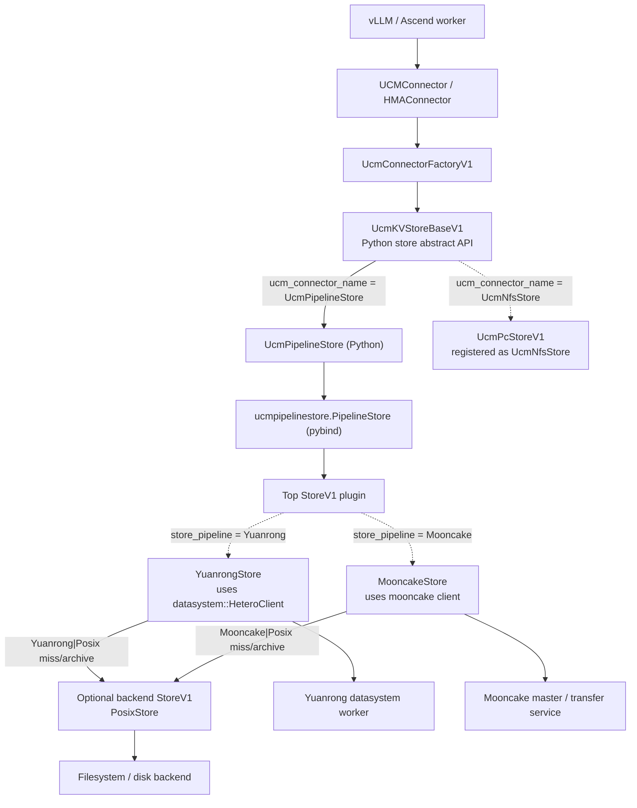
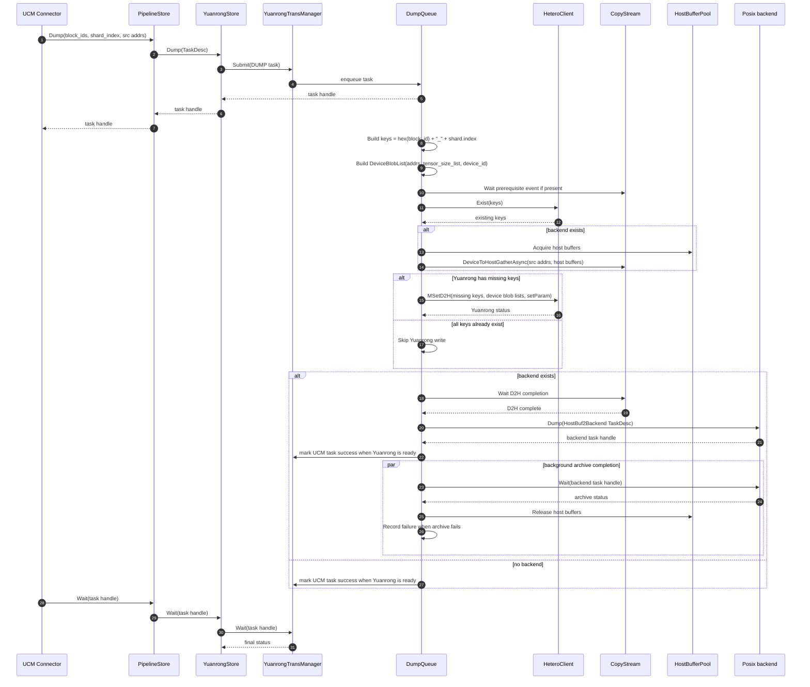
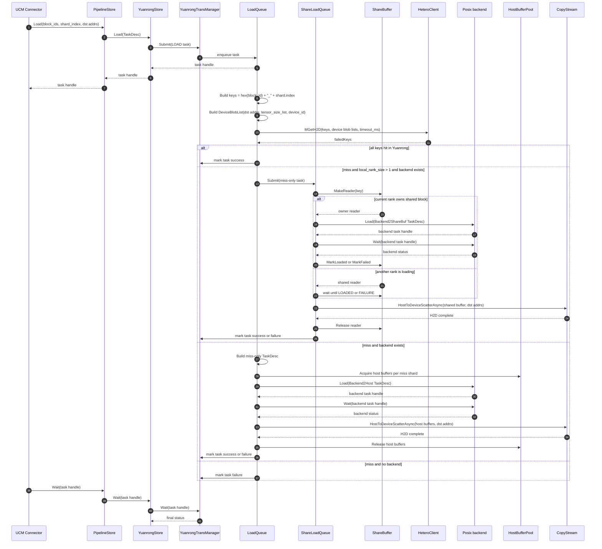

# Yuanrong HeteroClient 接入 UCM Pipeline 设计

## 1、背景与动机

UCM 通过 `UcmPipelineStore` 组合不同存储层，将 KV cache 从设备内存逐级下沉到外部缓存和落盘后端。Yuanrong 接入后作为 UCM 的二级缓存池，负责保存和回填设备侧 KV cache。

`Yuanrong|Posix` 通过 `PipelineStore.Stack()` 叠加 Posix 后端，形成设备内存 -> Yuanrong 二级缓存 -> Posix 三级落盘的层级。Yuanrong 命中时通过 `MGetH2D` 直接回填设备地址；Yuanrong miss 时从 Posix 回源；dump 时写入 Yuanrong，并归档到 Posix。

Yuanrong datasystem 的 `HeteroClient::MSetD2H` 对应 UCM `Dump`，`HeteroClient::MGetH2D` 对应 UCM `Load`，语义上能够映射到 `StoreV1`。因此 Yuanrong 作为新的 `StoreV1` 插件接入 `UcmPipelineStore`，复用现有 pipeline 组合、异步任务和多 rank 共享 miss 机制。

## 2、系统架构

Yuanrong 是 `UcmPipelineStore` 下方的 C++ `StoreV1` 插件。vLLM 只感知 `UcmKVStoreBaseV1` 抽象接口；`ucm_connector_name` 决定 Python 侧使用哪个 `UcmKVStoreBaseV1` 实现，`store_pipeline` 决定 `UcmPipelineStore` 加载哪个 C++ store 插件以及是否叠加 Posix 后端。




## 3、改动范围总览

本设计涉及 Python connector、C++ StoreV1 插件、pybind、vLLM connector、构建脚本和测试用例六类改动：

| 模块 | 改动内容 | 作用 |
| --- | --- | --- |
| `ucm/store/yuanrongstore` | 新增 `YuanrongStore` C++ 插件，实现 `StoreV1` 的 `Setup/Lookup/LookupOnPrefix/Load/Dump/Check/Wait/RegisterMemory` 接口；内部通过 `TransManager/LoadQueue/DumpQueue/ShareLoadQueue` 等队列结构执行异步传输 | 承载 Yuanrong 主路径和 Posix fallback/archive |
| `ucm/store/pipeline/connector.py` | 注册 `"Yuanrong"`、`"Yuanrong|Posix"` 两个 `store_pipeline` | 让 `UcmPipelineStore` 能加载 Yuanrong 插件 |
| `ucm/store/ucmstore_v1.h`、`ucm/store/ucmstore_v1.py` | 增加 `RegisterMemory` 统一接口 | 保持 vLLM connector 对不同 store 的统一初始化路径 |
| `ucm/store/pipeline/cpy/pipeline_store.py.cc` | 暴露 `RegisterMemory` 到 pybind | 打通 Python `UcmPipelineStore` 到 C++ `PipelineStore` 的注册调用 |
| `ucm/integration/vllm/ucm_connector.py` | store 创建后调用 `_register_kv_cache_memory()` | 统一触发 KV cache memory 注册；Yuanrong 的 `RegisterMemory` 为 no-op，原因是设备地址通过 `DeviceBlobList` 随每次 `MSetD2H/MGetH2D` 调用传入 |
| `ucm/store/CMakeLists.txt`、`ucm/store/yuanrongstore/CMakeLists.txt` | 增加 YuanrongStore 构建入口和 wheel 产物定位 | 从 Python wheel 定位 `libdatasystem.so` 并构建插件 |
| `examples/ucm_yuanrong_config.yaml`、`ucm/store/test/e2e` | 增加配置样例和 e2e | 验证 standalone、Posix fallback、多 rank 共享 miss |


## 4、核心实现

### YuanrongStore 结构

目录结构：

```text
ucm/store/yuanrongstore/
  CMakeLists.txt
  cc/
    yuanrong_store.cc
    yuanrong_config.h
    yuanrong_task.h
    trans_manager.cc
    trans_manager.h
    dump_queue.cc
    dump_queue.h
    load_queue.cc
    load_queue.h
    share_load_queue.cc
    share_load_queue.h
    share_buffer.cc
    share_buffer.h
    host_buffer_pool.h
    copy_stream.h
```

核心类：

```cpp
namespace UC::YuanrongStore {

class YuanrongStore : public StoreV1 {
public:
    Status Setup(const Detail::Dictionary& config) override;
    std::string Readme() const override;
    Expected<std::vector<uint8_t>> Lookup(const Detail::BlockId* blocks, size_t num) override;
    Expected<ssize_t> LookupOnPrefix(const Detail::BlockId* blocks, size_t num) override;
    void Prefetch(const Detail::BlockId* blocks, size_t num) override;
    Expected<Detail::TaskHandle> Load(Detail::TaskDesc task) override;
    Expected<Detail::TaskHandle> Dump(Detail::TaskDesc task) override;
    Expected<bool> Check(Detail::TaskHandle taskId) override;
    Status Wait(Detail::TaskHandle taskId) override;
    Status RegisterMemory(void* base_addr, size_t total_size) override;

private:
    Config config_;
    std::shared_ptr<datasystem::HeteroClient> client_;
    StoreV1* backend_{nullptr};
    TransManager transMgr_;
};

} // namespace UC::YuanrongStore

extern "C" UC::StoreV1* MakeYuanrongStore();
```

队列和任务管理采用异步结构。YuanrongStore 负责解析配置、初始化 `HeteroClient`，实际传输交给 `TransManager`：

```sh
YuanrongStore
  -> TransManager : 继承/复用 Detail::TaskWrapper
    -> DumpQueue  : 调用 MSetD2H 写入 Yuanrong；如有 backend，则用 CopyStream 将设备数据拷到 host buffer 后提交 backend->Dump 归档
    -> LoadQueue  : 优先调用 MGetH2D 从 Yuanrong 回填设备地址；miss 时构造 miss-only 任务，从 backend->Load 拉到 host buffer，再 H2D 到目标设备地址
    -> ShareLoadQueue : 多 rank 场景共享 backend miss 回源结果
    -> ShareBuffer : 同节点多 rank 共享 host buffer
    -> HostBufferPool : backend 回源/归档使用的 pinned/direct-io host buffer
    -> CopyStream : backend host buffer 与 device tensor 之间的 H2D/D2H scatter/gather
```

`Yuanrong|Posix` 中，Yuanrong 是高速主路径，Posix 是 miss fallback 和归档层；`DumpQueue`、`LoadQueue` 和 `ShareLoadQueue` 负责两级存储协同，同节点多 rank miss 通过共享 host buffer 减少重复 Posix 回源，UCM 对外保持异步 `TaskHandle` 语义。


### 接口映射

| UCM StoreV1                   | Yuanrong HeteroClient                              | 适配说明                                                     |
| ----------------------------- | -------------------------------------------------- | ------------------------------------------------------------ |
| `Setup(config)`               | `HeteroClient(connectOpts).Init()`                 | 从 UCM config 构造 `datasystem::ConnectOptions`              |
| `Lookup(blocks, num)`         | `Exist(keys, exists)`                              | 将 UCM `BlockId + shard_index` 转为 Yuanrong key；lookup 通常查 shard `0` |
| `LookupOnPrefix(blocks, num)` | `Exist(keys, exists)` + optional backend lookup    | 先查询 Yuanrong；出现首次 miss 后，从对应位置继续查询 backend 的连续命中长度 |
| `Load(TaskDesc)`              | `MGetH2D(keys, devBlobLists, failedKeys, timeout)` | Yuanrong 从 host 对象读取并 H2D 写入 UCM 提供的设备地址；miss 通过 Posix 回源 |
| `Dump(TaskDesc)`              | `MSetD2H(keys, devBlobLists, setParam)`            | Yuanrong 从 UCM 设备地址 D2H 写入 host 对象                  |
| `Check/Wait`                  | UCM `TaskWrapper` + queue waiter                   | 使用 `TransManager/LoadQueue/DumpQueue` 异步任务模型         |
| `RegisterMemory`              | no-op                                              | HeteroClient 每次调用传 `DeviceBlobList{deviceIdx, Blob{ptr,size}}`，没有独立 register API，不需要预注册设备内存 |


### 关键类与结构

`yuanrong_config.h`

```cpp
struct Config {
    std::string host{"127.0.0.1"};
    int32_t port{9088};
    bool enableRemoteH2D{true};
    int32_t deviceId{-1};
    size_t timeoutMs{60000};
    std::vector<uint64_t> tensorSizeList{};
    size_t localRankSize{1};
    uint64_t shareBufferCapacity{64ULL << 30};
    size_t shareBufferNumber{0};
    bool ioDirect{false};
    StoreV1* storeBackend{nullptr};
};
```

职责：
- 保存从 `Detail::Dictionary` 解析出的 Yuanrong、设备、队列和 backend 配置。
- `shareBufferNumber` 由 `shareBufferCapacity / sum(tensorSizeList)` 推导，表示共享 miss buffer 能容纳多少个 block。
- `storeBackend` 来自 `PipelineStore.Stack()` 注入的 `store_backend`，在 `"Yuanrong|Posix"` 中指向 Posix。

`yuanrong_task.h`

```cpp
enum class TaskType { LOAD, DUMP };

struct TransShard {
    std::string key;
    Detail::BlockId owner;
    size_t index;
    std::vector<void*> addrs;
    std::vector<size_t> sizes;
};

struct TransTask {
    Detail::TaskHandle id;
    TaskType type;
    std::string brief;
    std::vector<TransShard> shards;
    uintptr_t prerequisiteHandle{0};
};
```

职责：
- `TransShard` 是 UCM `Detail::Shard` 到 Yuanrong 传输任务的中间表示。
- `key` 使用 `Hex(BlockId) + "_" + shard.index`。
- `addrs/sizes` 一一对应，用于构造 `datasystem::DeviceBlobList`。
- `prerequisiteHandle` 仅 dump 使用，用于等待上游 NPU event 后再执行 D2H。

`yuanrong_store.cc`

```cpp
class YuanrongStore : public StoreV1 { ... };
```

职责：
- 实现 UCM `StoreV1` 对外接口。
- `Setup()` 解析配置，构造并初始化 `datasystem::HeteroClient`，再初始化 `TransManager`。
- `Lookup/LookupOnPrefix()` 调用 `HeteroClient::Exist()` 查询 `Hex(BlockId) + "_0"`。
- `Load/Dump()` 将 `Detail::TaskDesc` 转为 `TransTask` 后提交给 `TransManager`。
- `Check/Wait()` 转发给 `TransManager`。
- `RegisterMemory()` 为 no-op 并返回成功，保持与 UCM connector 通用接口兼容；Yuanrong 不维护独立的内存注册表，设备地址由每次 `MSetD2H/MGetH2D` 调用携带。

`trans_manager.h/.cc`

```cpp
class TransManager : public Detail::TaskWrapper<TransTask, Detail::TaskHandle> {
    DumpQueue dumpQ_;
    LoadQueue loadQ_;
    ShareLoadQueue shareLoadQ_;
    HostBufferPool hostBufPool_;
};
```

职责：
- 负责异步 task 生命周期：`Submit/Check/Wait/failureSet`。
- 初始化 Yuanrong `HeteroClient` 依赖的 load/dump 队列。
- 当 `localRankSize > 1 && storeBackend != nullptr` 时初始化 `ShareLoadQueue`。
- `Dispatch()` 根据 `TaskType` 把任务送入 `LoadQueue` 或 `DumpQueue`。

`dump_queue.h/.cc`

职责：
- 消费 DUMP task。
- 将 task shards 转成 keys 和 `DeviceBlobList`。
- 如 `prerequisiteHandle != 0`，先让 copy stream 等待 event，保证设备侧计算完成。
- 调用 `HeteroClient::MSetD2H(keys, blobLists, setParam)` 写入 Yuanrong host 对象。
- 如存在 backend，则从设备地址 D2H gather 到 `HostBufferPool`，构造 `HostBuf2Backend` 任务并提交 `backend->Dump()` 归档。
- 后台等待 backend dump 完成，失败时写入 `failureSet`。

`load_queue.h/.cc`

职责：
- 消费 LOAD task。
- 将 task shards 转成 keys 和目标 `DeviceBlobList`。
- 先调用 `HeteroClient::MGetH2D(keys, blobLists, timeoutMs)`，命中的 key 直接回填设备地址。
- 对 `failedKeys` 构造 miss-only task。
- 多 rank 且有 backend 时，将 miss task 提交给 `ShareLoadQueue`。
- 非共享场景下，从 backend `Load(Backend2Host)` 到私有 host buffer，再 `HostToDeviceScatterAsync()` 写回目标设备地址。

`share_load_queue.h/.cc`

职责：
- 处理多 rank 共享 miss。
- 对每个 miss key 调用 `ShareBuffer::MakeReader(key)`。
- owner rank 负责从 backend `Load(Backend2ShareBuf)` 到共享 buffer，然后 `MarkLoaded()`。
- 非 owner rank 等待共享 block 从 `LOADING` 变为 `LOADED`。
- 所有 rank 最终从共享 buffer H2D scatter 到自己的目标设备地址。
- 任一阶段失败时 `MarkFailed()` 并标记对应 UCM task 失败。

`share_buffer.h/.cc`

职责：
- 管理同节点进程共享内存，shm 名称由 `unique_id` 派生。
- 每个 block 有 header，记录 key、ref、状态 `INIT/LOADING/LOADED/FAILURE`。
- `MakeReader(key)` 返回本地临时 reader 或共享 reader。
- `Ready4Read()` 返回 `OK/Retry/DuplicateKey/Error`：
  - `DuplicateKey` 表示当前 rank 抢到 owner，需要从 backend 回源填充共享 buffer。
  - `Retry` 表示其他 rank 正在加载，当前 rank 继续等待。
  - `OK` 表示共享 buffer 已 ready，执行 H2D。

`host_buffer_pool.h`

职责：
- 预分配 pinned host buffer 或 direct-io host buffer。
- 为 backend fallback 和 dump archive 提供固定大小 buffer。
- buffer 单元大小为 `sum(tensorSizeList)`，即一个 UCM block 的所有 tensor bytes 总和。

`copy_stream.h`

职责：
- 封装设备 copy stream。
- 提供 `WaitEvent()`、`Synchronize()`、`HostToDeviceAsync()`、`DeviceToHostAsync()` 这类队列需要的 copy 操作。
- DumpQueue 用它做 D2H gather，LoadQueue/ShareLoadQueue 用它做 H2D scatter。

### Key 设计

 **key 规则：**

```text
key = Hex(BlockId) + "_" + shard_index
```

其中：

```cpp
std::string BlockIdToKey(const Detail::BlockId& block)
```

将 `Detail::BlockId` 转十六进制字符串。UCM 一个 block 可能包含多个 layer/tensor 地址，`shard_index` 用于区分同一 block 的 shard。

`Lookup/LookupOnPrefix` 默认查：

```text
Hex(BlockId) + "_0"
```

表示只要 shard 0 存在，就认为该 block 可恢复。一个 Block 代表一个完整的 KV cache chunk（包含多个 token），一个 Shard 是 Block 的一个切片。

**Key 示例**：

```
BlockId = [0xa1, 0xb2, 0xc3, ..., 0xef]  (16 bytes)
Hex(BlockId) = "a1b2c3d4e5f6...ef"       (32 chars)
shard_index = 0
key = "a1b2c3d4e5f6...ef_0"
```

### DeviceBlobList 构造

Yuanrong 数据结构：

```cpp
struct Blob {
    void* pointer = 0;
    uint64_t size = 0;
};

struct DeviceBlobList {
    std::vector<Blob> blobs;
    int32_t deviceIdx = -1;
    int32_t srcOffset = 0;
};
```

UCM `Detail::Shard` 中已有：

```cpp
Detail::BlockId owner;
size_t index;
std::vector<void*> addrs;
```

UCM 当前传入的是地址，没有每个地址对应的 size。`tensor_size_list` 表达每个地址对应的数据长度，Yuanrong 使用这个配置构造 `DeviceBlobList`：

```yaml
tensor_size_list:
  - 32768
  - 32768
  # 每个 addrs[i] 对应一个 size
```

转换规则：

```cpp
datasystem::DeviceBlobList ToDeviceBlobList(const Detail::Shard& shard) {
    datasystem::DeviceBlobList list;
    list.deviceIdx = config.deviceId;
    for (size_t i = 0; i < shard.addrs.size(); ++i) {
        list.blobs.push_back(datasystem::Blob{
            .pointer = shard.addrs[i],
            .size = config.tensorSizeList[i],
        });
    }
    return list;
}
```

如果 `shard.addrs.size() > tensor_size_list.size()`，返回 `Status::InvalidParam`。KV cache 数据不能静默截断，否则会造成数据不完整。


## 5、接入适配

### 配置设计

新增示例：

```text
examples/ucm_yuanrong_config.yaml
```

配置内容：

```yaml
ucm_connectors:
  - ucm_connector_name: "UcmPipelineStore"
    ucm_connector_config:
      store_pipeline: "Yuanrong|Posix"

      # Yuanrong worker connection.
      yuanrong_host: "127.0.0.1"
      yuanrong_port: 9088
      yuanrong_enable_remote_h2d: true

      # Device and tensor layout.
      tensor_size_list: []
      timeout_ms: 60000
      local_rank_size: 1
      share_buffer_capacity_gb: 64

      # Posix backend fallback/archive.
      storage_backends: "/mnt/test"
      io_direct: false

enable_event_sync: true
use_layerwise: false
```

`device_id` 由 UCM worker 侧已有逻辑注入：

```python
worker = UcmPipelineStore(config | {"device_id": device_id})
scheduler = UcmPipelineStore(config)
```

Yuanrong `HeteroClient` 同时承载 `Exist` 和 `MSetD2H/MGetH2D`，因此不区分 worker RealClient 和 scheduler RPC Client。没有 `device_id` 的 scheduler 实例同样初始化 HeteroClient，只执行 `Lookup`。

### Pipeline 注册

修改：

```text
ucm/store/pipeline/connector.py
```

新增：

```python
def _yuanrong_pipeline_builder(config, pipeline):
    store_dir = Path(__file__).resolve().parent.parent
    pipeline.Stack(
        "Yuanrong", str(store_dir / "yuanrongstore/libyuanrongstore.so"), config
    )


def _yuanrong_posix_pipeline_builder(config, pipeline):
    store_dir = Path(__file__).resolve().parent.parent
    posix_config = copy.deepcopy(config)
    if config.get("device_id", -1) >= 0:
        posix_config |= {"tensor_size": config["shard_size"]}
    pipeline.Stack("Posix", str(store_dir / "posix/libposixstore.so"), posix_config)
    pipeline.Stack(
        "Yuanrong", str(store_dir / "yuanrongstore/libyuanrongstore.so"), config
    )


UcmPipelineStoreBuilder.register("Yuanrong", _yuanrong_pipeline_builder)
UcmPipelineStoreBuilder.register("Yuanrong|Posix", _yuanrong_posix_pipeline_builder)
```

`Stack` 关键顺序：先 Stack Posix（底层），再 Stack Yuanrong（顶层）。

`PipelineStore.Stack()` 内部会将当前栈顶 store 通过 `config.Set("store_backend", StoreBack())` 注入给新 store。因此 YuanrongStore 在初始化时会获得 `storeBackend = PosixStore`，用于 miss 回源和 dump 归档。

### StoreV1 RegisterMemory

StoreV1 增加统一的内存注册接口：

1. `ucm/store/ucmstore_v1.h`
   - 增加 `virtual Status RegisterMemory(void* base_addr, size_t total_size) = 0;`
2. 所有现有 C++ store
   - `Cache/Empty/Fake/Posix/Ds3fs` 返回 `Status::OK()`
   - `Compress` 转发给 backend
3. `ucm/store/pipeline/cpy/pipeline_store.py.cc`
   - 增加 `RegisterMemory(uintptr_t base_addr, size_t total_size)`
   - pybind 暴露 `.def("RegisterMemory", ...)`
4. `ucm/store/ucmstore_v1.py`
   - 增加 abstract `register_memory`
5. `ucm/store/pipeline/connector.py`
   - 增加 `register_memory` 转发

Yuanrong 中：

```cpp
Status RegisterMemory(void* base_addr, size_t total_size) override
{
    (void)base_addr;
    (void)total_size;
    return Status::OK();
}
```

HeteroClient 的设备地址通过 `DeviceBlobList` 随 `MSetD2H/MGetH2D` 提交，不需要预注册。因此 Yuanrong 的 `RegisterMemory` 实现为 no-op，仅返回成功以完成统一接口闭环；对需要显式注册的 store，该调用仍然执行真实注册。

### vLLM 侧改造

vLLM connector 在 store 创建后执行统一的 KV cache memory 注册：

```text
ucm/integration/vllm/ucm_connector.py
```

在 store 创建后调用：

```python
self._register_kv_cache_memory()
```

Yuanrong 的 `RegisterMemory` 为 no-op，原因是：

1. `MSetD2H/MGetH2D` 每次调用都会携带 `DeviceBlobList{deviceIdx, Blob{ptr,size}}`。
2. HeteroClient 没有独立的 register API，也不依赖预注册后的 buffer handle。
3. UCM connector 保持统一调用路径，对需要显式注册的 store 仍然执行真实注册。

## 6、Load/Dump 详细流程

### Dump

`Yuanrong|Posix` 的 Dump 整体流程：

1. 构造 Yuanrong key 和 `DeviceBlobList`，调用 `Exist` 检查 key 是否已经存在。
2. 为 Posix 归档从 `HostBufferPool` 申请 pinned/DirectIO host buffer。
3. 通过 `CopyStream` 异步提交 Device -> host buffer 的 D2H gather。
4. 对 Yuanrong 中不存在的 key，同步调用 `MSetD2H`，将设备侧 KV cache 写入 Yuanrong host 对象。
5. 等待 D2H gather 完成。
6. 使用 host buffer 提交 `PosixStore::Dump()` 归档任务。
7. Yuanrong 写入成功且 Posix 任务提交成功后，将 UCM Dump 任务标记完成。
8. 后台线程等待 Posix 写盘完成，随后释放 host buffer；写盘失败时记录到 `failureSet`。



DumpQueue 负责 Yuanrong 写入和 Posix 归档两条路径。Posix 所需的 D2H gather 与 Yuanrong `MSetD2H` 重叠执行；Posix 任务提交成功后即可完成 UCM Dump 任务，实际写盘和 host buffer 释放由后台线程处理。

### Load

`Yuanrong|Posix` 的 Load 整体流程：

1. 构造 Yuanrong key、目标设备地址和 `DeviceBlobList`。
2. 调用 `MGetH2D`，将 Yuanrong 中命中的 KV cache 直接回填到设备地址，并通过 `failedKeys` 收集 miss。
3. 全部命中时，将 UCM Load 任务标记完成。
4. 存在 miss 且没有 Posix backend 时，将 UCM Load 任务标记失败。
5. 单 rank 或未启用共享 miss 时，从 `HostBufferPool` 申请 host buffer，提交 `PosixStore::Load()`。
6. Posix 回源完成后，通过 `CopyStream` 将 host buffer H2D scatter 到对应设备地址，释放 host buffer。
7. 多 rank 共享 miss 时，各 rank 通过 `ShareBuffer::MakeReader()` 竞争 owner；owner rank 负责从 Posix 回源到共享 buffer。
8. 非 owner rank 等待共享 buffer 进入 `LOADED` 或 `FAILURE` 状态，不重复读取 Posix。
9. 各 rank 从共享 buffer H2D scatter 到自己的设备地址；所有 miss shard 回填完成后，将 UCM Load 任务标记完成。



LoadQueue 负责两级 load：先用 `MGetH2D` 从 Yuanrong host 对象直接回填设备地址；对 `failedKeys` 构造 miss-only 任务。`local_rank_size > 1` 且存在 Posix backend 时，miss 交给 `ShareLoadQueue`，同节点只让一个 rank 从 Posix 回源到 `ShareBuffer`，其他 rank 等共享 block ready 后各自 H2D 到目标设备地址。未启用共享 miss 时，使用私有 `HostBufferPool` 从 Posix 拉到 host buffer，再通过 `CopyStream` H2D scatter。没有 backend 时，miss 标记当前 UCM task 失败，上层按既有逻辑重算或处理错误。

## 7、构建设计

新增：

```text
ucm/store/yuanrongstore/CMakeLists.txt
```

Yuanrong 产物来自 Python wheel，构建时不写开发机绝对路径。定位顺序：

1. 优先使用 CMake 变量 `YUANRONG_SDK_ROOT`，指向 wheel 解包/安装后的 `yr/datasystem` 目录。
2. 未显式传入时，通过当前 Python 环境查询 `yr.datasystem` 的安装目录。
3. C++ 只链接 wheel 内的 `lib/libdatasystem.so`，不链接 `libds_client_py.so`。

wheel 典型布局：

```text
<site-packages>/yr/datasystem/
  lib/libdatasystem.so
  lib/libacl_plugin.so
  lib/libp2p_transfer.so
  ...
```

头文件不从本地源码绝对路径查找。当前通过 `YUANRONG_INCLUDE_DIR` 显式传入 Yuanrong SDK headers 路径；wheel 打包 headers 后，默认路径为 `${YUANRONG_SDK_ROOT}/include`。

```cmake
if(NOT YUANRONG_SDK_ROOT)
    execute_process(
        COMMAND ${Python3_EXECUTABLE} -c
                "import pathlib, yr.datasystem as ds; print(pathlib.Path(ds.__file__).resolve().parent)"
        OUTPUT_VARIABLE YUANRONG_SDK_ROOT
        OUTPUT_STRIP_TRAILING_WHITESPACE
        ERROR_QUIET
    )
endif()

if(NOT YUANRONG_INCLUDE_DIR AND YUANRONG_SDK_ROOT)
    set(YUANRONG_INCLUDE_DIR "${YUANRONG_SDK_ROOT}/include")
endif()

set(YUANRONG_LIB_DIR "${YUANRONG_SDK_ROOT}/lib")
set(YUANRONG_LIBRARY "${YUANRONG_LIB_DIR}/libdatasystem.so")

if(EXISTS "${YUANRONG_INCLUDE_DIR}/datasystem/hetero_client.h"
   AND EXISTS "${YUANRONG_LIBRARY}")
    file(GLOB_RECURSE SOURCES "./cc/*.cc")
    add_library(yuanrongstore SHARED ${SOURCES})
    target_compile_features(yuanrongstore PUBLIC cxx_std_20)
    target_include_directories(yuanrongstore PUBLIC
        ${CMAKE_CURRENT_SOURCE_DIR}/cc
        ${YUANRONG_INCLUDE_DIR}
    )
    target_link_libraries(yuanrongstore PUBLIC
        storeintf infra_logger fmt ${YUANRONG_LIBRARY}
    )
    set_target_properties(yuanrongstore PROPERTIES
        INSTALL_RPATH "${YUANRONG_LIB_DIR}"
        BUILD_WITH_INSTALL_RPATH TRUE
    )
    file(RELATIVE_PATH INSTALL_REL_PATH ${UCM_ROOT_DIR} ${CMAKE_CURRENT_SOURCE_DIR})
    install(TARGETS yuanrongstore LIBRARY DESTINATION ${INSTALL_REL_PATH} COMPONENT ucm)
else()
    message(STATUS "yuanrongstore: skipping build - Yuanrong wheel lib or headers not found")
    message(STATUS "  YUANRONG_SDK_ROOT=${YUANRONG_SDK_ROOT}")
    message(STATUS "  YUANRONG_INCLUDE_DIR=${YUANRONG_INCLUDE_DIR}")
    message(STATUS "  YUANRONG_LIBRARY=${YUANRONG_LIBRARY}")
endif()
```

顶层：

```text
ucm/store/CMakeLists.txt
```

新增：

```cmake
add_subdirectory(yuanrongstore)
```

如果 wheel 当前没有携带 headers，构建命令显式传：

```bash
cmake -S . -B build \
  -DYUANRONG_INCLUDE_DIR=/path/to/yuanrong/include
```

运行时需要确保 `libdatasystem.so` 的依赖库可被动态链接器找到。优先通过 wheel 的 `yr/datasystem/lib` 提供依赖；如果部署布局不同，则设置 `LD_LIBRARY_PATH` 或调整 `INSTALL_RPATH`。

## 8、测试与约束

### 单元级

`YuanrongStore` 抽出小函数并覆盖单测：

```text
BlockIdToKey
BuildKeys
BuildDeviceBlobLists
BuildMissTaskDesc
ParseConfig
```

### E2E

沿用 UCM 现有 cache/posix e2e 结构：

```python
config["store_pipeline"] = "Yuanrong|Posix"
config["yuanrong_host"] = os.environ.get("YUANRONG_HOST", "127.0.0.1")
config["yuanrong_port"] = int(os.environ.get("YUANRONG_PORT", "9088"))
config["tensor_size_list"] = [tensor_size] * (layer_size * chunk_size)
config["local_rank_size"] = int(os.environ.get("LOCAL_RANK_SIZE", "1"))
config["share_buffer_capacity_gb"] = 64
```

测试步骤：

1. scheduler `lookup` 初始全 miss。
2. worker `dump` 写入 Yuanrong。
3. scheduler `lookup` 全 hit。
4. worker `load` 到新 tensor。
5. 比较源 tensor 和目标 tensor。
6. `Yuanrong|Posix` 场景下手动删除 Yuanrong key，验证 Posix fallback。
7. `local_rank_size > 1` 场景下并发 load 同一批 miss key，验证只有 owner rank 从 Posix 回源，其他 rank 通过 `ShareBuffer` H2D，所有 rank 数据一致。

### 约束与处理

1. **对象生命周期**
   - `MSetD2H/MGetH2D` 写入和读取的是 Yuanrong host 对象，适合持久化 KV cache。
   - Yuanrong 侧对象由后续 eviction/delete 机制回收，否则对象会累积。

2. **key 数量限制**
   - HeteroClient 文档约束单次 keys 不超过 10000。
   - UCM batch 超过限制时执行分批。

3. **tensor_size_list 必须准确**
   - UCM 只传地址，不传 size。
   - size 错会导致 Yuanrong 读写越界或数据不完整。

4. **队列复杂度**
   - 首期采用 `LoadQueue/DumpQueue/ShareLoadQueue` 结构实现，复杂度高于同步薄封装。
   - 好处是 `Yuanrong|Posix` 的归档、miss 回源、多 rank 共享 miss、事件同步、host buffer 生命周期都在 queue 内闭环，避免后续再推翻实现。

5. **RegisterMemory 对 Yuanrong 是 no-op**
   - 保留接口用于兼容 vLLM connector 的统一调用路径。
   - YuanrongStore 不维护注册表，也不伪造不存在的 register 语义；设备地址在每次 `MSetD2H/MGetH2D` 调用中通过 `DeviceBlobList` 传入。

6. **fallback 语义要明确**
   - `Yuanrong` standalone miss 返回失败，让上层重算。
   - `Yuanrong|Posix` miss 尝试 backend。
